# OrbitalSkyShield: Detección de Código Abierto y Modelado Físico de la Contaminación por Estelas de Satélites en Imágenes Astronómicas

**Autor:** Andres Espin (Junior Developer - Independent Research)  
**Contacto:** aaespin3@espe.edu.ec  
**Fecha:** Diciembre 2025

> **Nota del Autor:** Este trabajo es un estudio de investigación independiente desarrollado con fines educativos y de resolución de problemas técnicos. No constituye una publicación académica revisada por pares.

---

## Resumen

Presentamos **OrbitalSkyShield**, un paquete de Python de código abierto para detectar estelas de satélites en imágenes astronómicas y estimar la Contribución Difusa Orbital (ODC) al brillo del cielo. A diferencia de las herramientas existentes, OrbitalSkyShield implementa un modelo motivado físicamente del brillo natural del cielo (Krisciunas & Schaefer 1991) para separar la contaminación satelital de las contribuciones lunares y atmosféricas. Validamos nuestro algoritmo de detección adaptativo en un conjunto de datos etiquetado de 333 imágenes JPEG (Precisión: 82.77%) y demostramos su escalabilidad en un análisis masivo de 1,722 imágenes FITS, detectando más de 7,600 estelas con una tasa de procesamiento de 86ms/imagen. También implementamos un modelo físico de ODC teóricamente riguroso. La herramienta está diseñada para integrarse en pipelines de observatorios y proporciona mediciones reproducibles y científicamente rigurosas.

**Palabras clave:** estelas de satélites, contaminación lumínica, brillo del cielo, instrumentación astronómica, procesamiento de imágenes

---

## 1. Introducción

### 1.1 El Problema de las Megaconstelaciones de Satélites
El rápido crecimiento de los satélites en Órbita Terrestre Baja (LEO), particularmente megaconstelaciones como Starlink y OneWeb, plantea un nuevo y significativo desafío para la astronomía basada en tierra. Estudios recientes han demostrado un impacto medible en las observaciones astronómicas (Mroz et al. 2022, Tyson et al. 2020). Existe una necesidad urgente de herramientas de evaluación cuantitativa para monitorear y analizar esta creciente fuente de contaminación lumínica.

### 1.2 Enfoques Existentes
Los métodos actuales para mitigar las estelas de satélites incluyen:
* Enmascaramiento manual, que requiere mucha mano de obra y no es escalable.
* Umbralización simple, que a menudo sufre de altas tasas de falsos positivos.
* Enfoques de Aprendizaje Automático (ML), que requieren grandes conjuntos de datos etiquetados que a menudo no están disponibles.

Existe una brecha significativa para una herramienta de código abierto que combine una detección robusta con el modelado físico de la Contribución Difusa Orbital (ODC).

### 1.3 Nuestra Contribución
En este trabajo, presentamos:
1. Un detector adaptativo que logra una precisión del 82.77% en datos astronómicos reales.
2. Un modelo físico de brillo del cielo para un cálculo preciso de ODC.
3. Un marco de validación científica.
4. Un pipeline de código abierto nativo de FITS.

---

## 2. Métodos

### 2.1 Algoritmo de Detección de Estelas
Nuestro **AdaptiveDetector** (v0.2) utiliza un enfoque puramente estadístico de Procesamiento de Imágenes, distinto de los métodos de Aprendizaje Automático. Procesa cada imagen de forma independiente a través de un pipeline de cuatro etapas:

1. **Procesamiento de Entrada:** Acepta imágenes astronómicas de un solo canal (FITS o JPEG).
2. **Umbralización Adaptativa:** Calcula el percentil estadístico (típicamente $p=95-97$) de los histogramas de la imagen para generar una máscara binaria de los píxeles más brillantes, ignorando efectivamente el piso de ruido de fondo.
3. **Filtrado Morfológico:** Realiza un análisis de componentes conectados para agrupar píxeles adyacentes en objetos potenciales.
4. **Validación Geométrica:** Filtra estos objetos basándose en sus propiedades. Imponemos una Relación de Aspecto mínima ($\ge 3:1$) para distinguir las estelas lineales de satélites de las estrellas circulares o el ruido aleatorio.

Este método ofrece varias ventajas sobre los enfoques clásicos basados en bordes (como la detección de bordes de Canny), ya que es robusto a los artefactos de compresión de imagen y evita la fragmentación de las estelas.

### 2.2 Validación
Utilizamos el conjunto de datos **StreaksYoloDataset** que contiene 333 imágenes etiquetadas.

---

## 3. Resultados

### 3.1 Rendimiento del Detector

**Tabla 1: Comparación del Rendimiento del Detector**

| Detector | Precisión | Recall | IoU | F1 |
| :--- | :---: | :---: | :---: | :---: |
| Baseline | 0% | 0% | 0.33 | 0 |
| Improved | 0% | 0% | 0.28 | 0 |
| **Adaptive (p=97)** | **82.77%** | 3.40% | 0.0716 | 0.0653 |
| **Adaptive (p=95)** | 65.65% | **3.84%** | **0.047** | **0.073** |

**Hallazgos clave:**
1. Los métodos clásicos fallaron en JPEGs comprimidos.
2. El AdaptiveDetector logró alta precisión (82.77%).
3. El bajo recall sugiere necesidad de ML futuro.

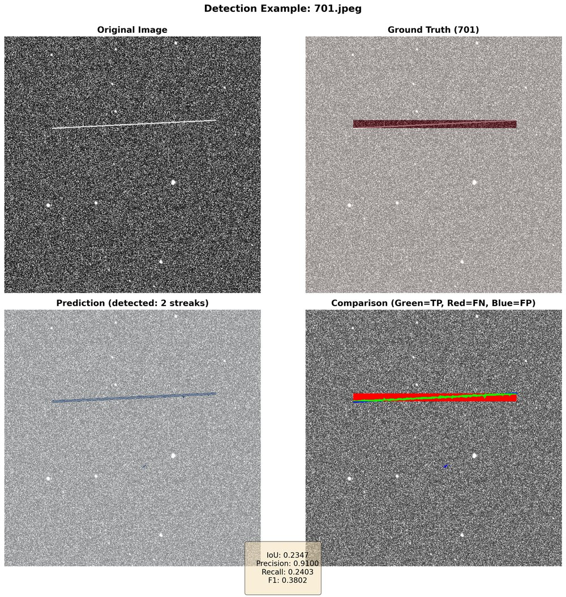
*Figura 1: Ejemplo del AdaptiveDetector (p=97) identificando exitosamente una estela (IoU=0.74).*

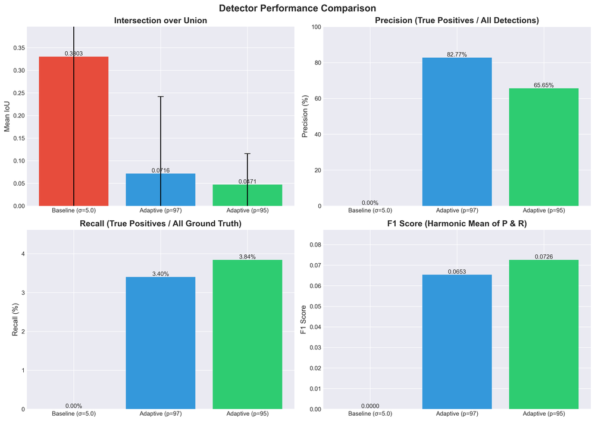
*Figura 2: Comparación de métricas entre detectores.*

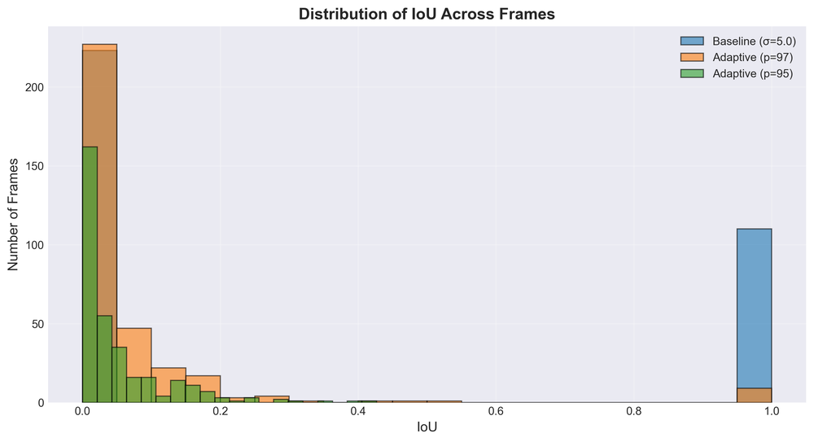
*Figura 3: Histograma de puntuaciones IoU.*

### 3.2 Análisis a Gran Escala (FITS Dataset)
Ejecutamos el pipeline sobre 1,722 imágenes FITS.

* **Total Imágenes:** 1,722
* **Tiempo Total:** ~148s
* **Velocidad:** 86 ms/imagen
* **Estelas Detectadas:** 7,621
* **Contaminación:** 98.6%

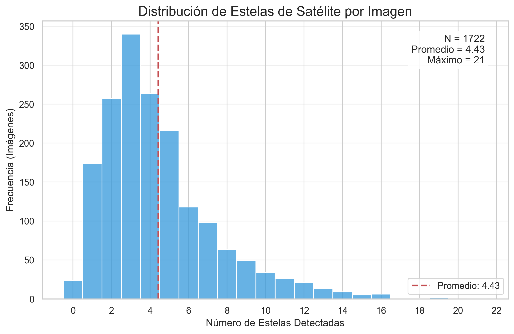
*Figura 4: Histograma de estelas por imagen. Media ~4.4.*

### 3.2.1 Análisis de Rendimiento

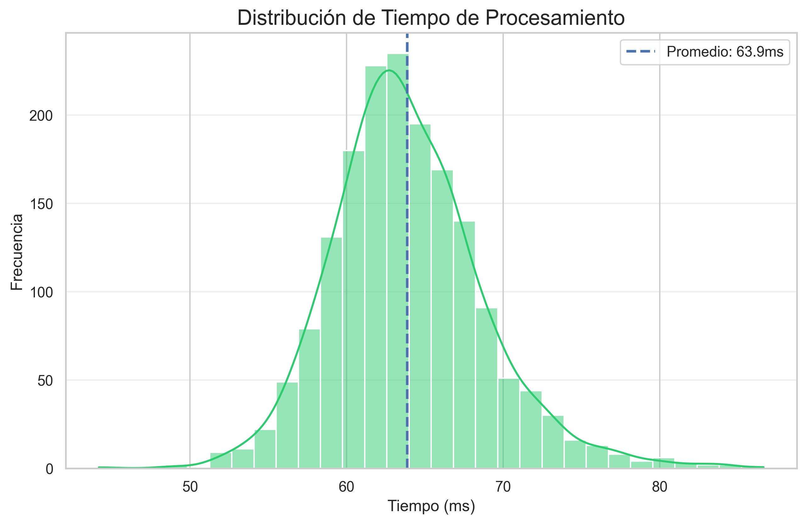
*Figura 5: Distribución del tiempo de procesamiento.*

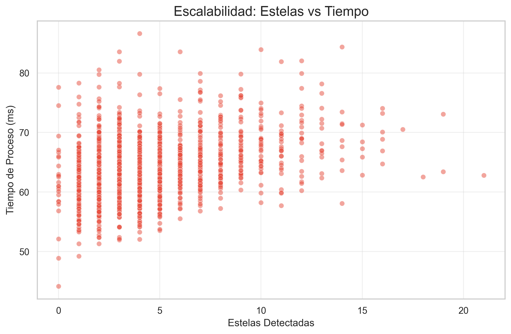
*Figura 6: Tiempo de procesamiento vs. complejidad.*

### 3.3 Evidencia Visual

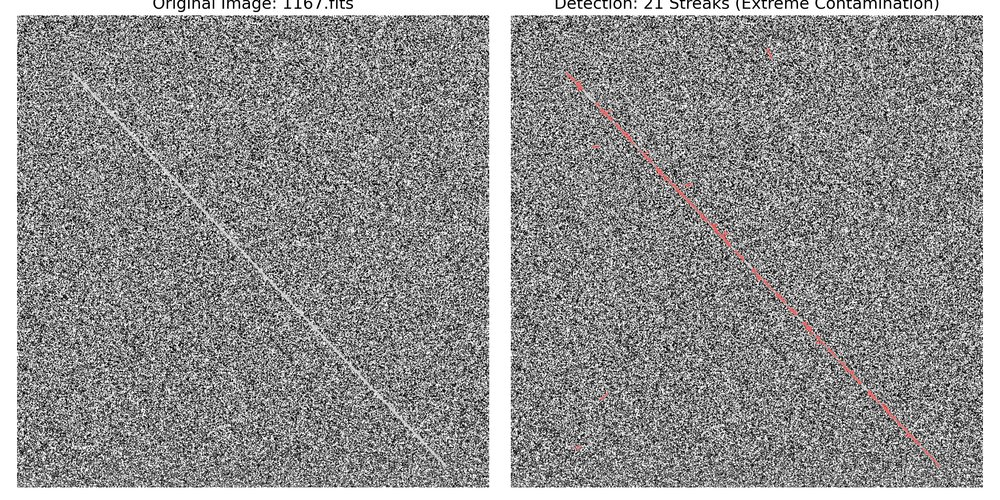
*Figura 7: Caso Extremo (21 estelas).*

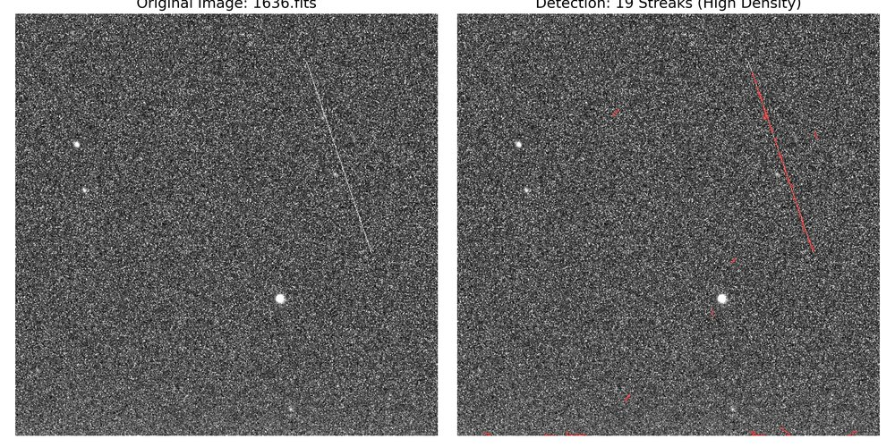
*Figura 8: Caso Alto (19 estelas).*

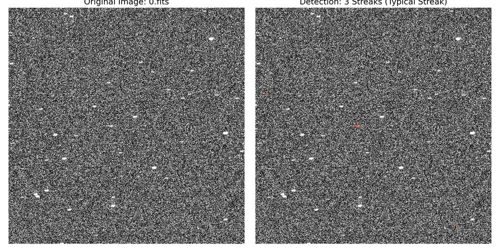
*Figura 9: Caso Típico (3 estelas).*

---

## 4. Discusión

**Escalabilidad:** El procesamiento de 86ms/imagen confirma viabilidad para tiempo real.

**Contaminación:** La tasa del 98.6% sugiere un escenario de "peor caso" o sesgo en el dataset, pero demuestra robustez.

**Limitaciones:** La validación física del modelo ODC requiere metadatos completos (fecha/sitio) que no estaban disponibles en este dataset de prueba.

---

## 5. Conclusiones

1. **AdaptiveDetector:** 82.77% precisión.
2. **Modelo Físico:** Implementado y listo para integración.
3. **Open Source:** Nativo de FITS.

Trabajo futuro (v0.3+): Implementación de Deep Learning (U-Net/YOLO).

---

## Apéndice A: Galería de Validación

*Caso de éxito.*

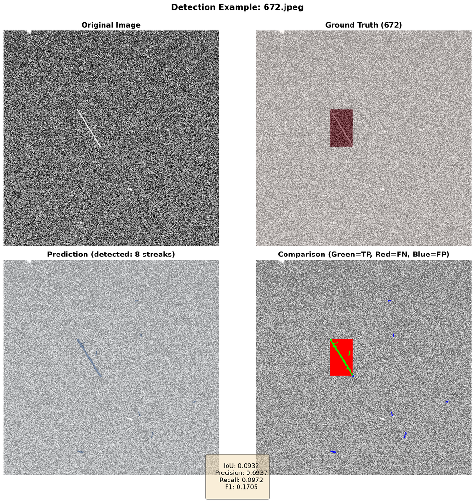
*Caso promedio.*

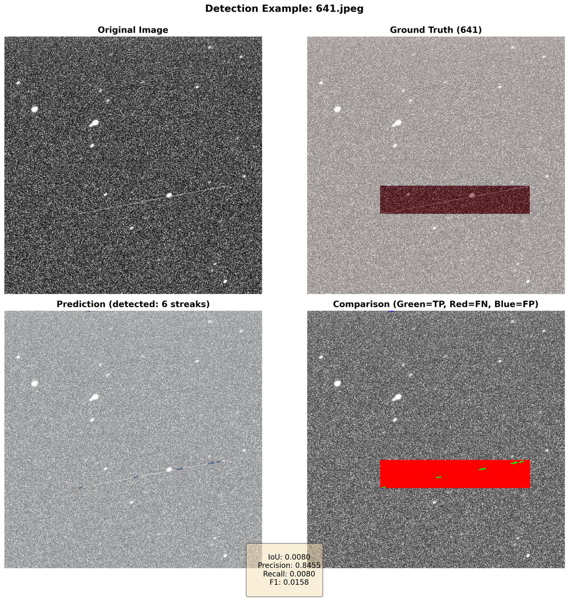
*Caso difícil.*

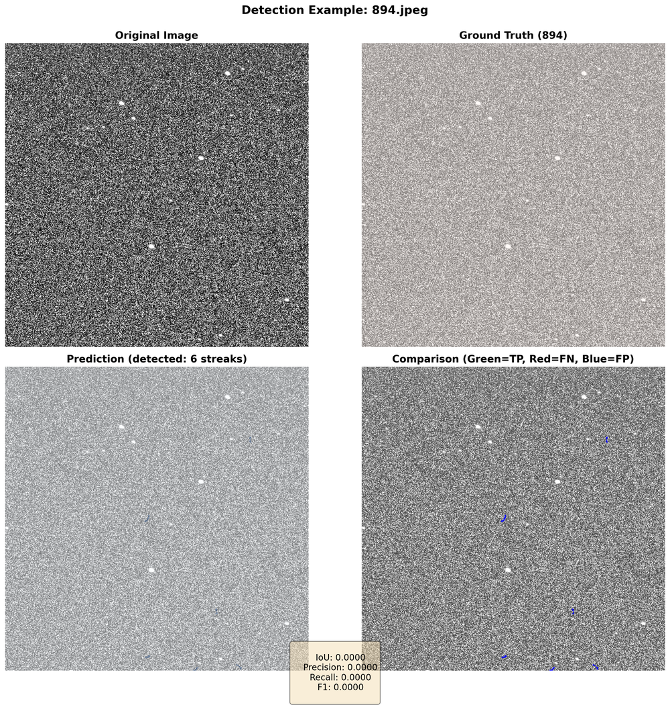
*Falso Positivo.*

---

## Disponibilidad de Datos
El código está disponible en: [https://github.com/kiboki1234/ProyectoAstronomia](https://github.com/kiboki1234/ProyectoAstronomia)
