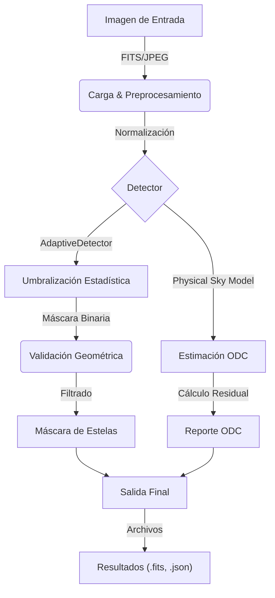

# OrbitalSkyShield: Guía de Usuario v0.2

Esta guía proporciona instrucciones detalladas para instalar, configurar y utilizar **OrbitalSkyShield**, una herramienta científica para detectar estelas de satélites en imágenes astronómicas.

---

## 🏗️ 1. Instalación

OrbitalSkyShield está diseñado para Python 3.9+.

### Prerrequisitos
*   Git
*   Python 3.9 o superior

### Instalación desde la fuente

```bash
# 1. Clonar el repositorio
git clone https://github.com/kiboki1234/ProyectoAstronomia.git
cd ProyectoAstronomia

# 2. Crear entorno virtual (Recomendado)
python -m venv venv
# Windows
venv\Scripts\activate
# Linux/Mac
source venv/bin/activate

# 3. Instalar dependencias
pip install -e .
pip install ephem tqdm pillow
```

---

## 📐 2. Arquitectura del Sistema

OrbitalSkyShield procesa imágenes a través de un pipeline modular.



---

## 💻 3. Uso por Línea de Comandos (CLI)

### Ejecución Básica
Para procesar una carpeta completa de imágenes FITS:

```bash
python -m orbitalskyshield.cli.main run --input-dir data/fits_dataset --output-dir results/analysis
```

### Opciones Disponibles
*   `--input-dir`: Directorio con imágenes `.fits`, `.jpg` o `.png`.
*   `--output-dir`: Donde se guardarán las máscaras y reportes.
*   `--detector`: Algoritmo a usar (default: `adaptive`). Opciones: `adaptive`, `baseline`.
*   `--threshold`: Percentil para detección adaptativa (default: `95`).

---

## 🐍 4. Uso como Biblioteca Python

Puedes integrar OrbitalSkyShield en tus propios scripts de astronomía.

```python
import matplotlib.pyplot as plt
from orbitalskyshield.streak_detection.improved_detector import AdaptiveDetector
from astropy.io import fits

# 1. Cargar imagen
with fits.open('data/ejemplo.fits') as hdul:
    data = hdul[0].data

# 2. Inicializar detector (Optimizado para FITS)
detector = AdaptiveDetector(
    percentile_thresh=97.0,  # Más alto = Menos falsos positivos
    min_streak_length=30     # Longitud mínima en píxeles
)

# 3. Detectar
result = detector.detect(data)

# 4. Visualizar
plt.imshow(result.mask, cmap='hot')
plt.title(f"Estelas detectadas: {result.meta['detected_lines']}")
plt.show()
```

---

## 📊 5. Interpretación de Resultados

### Archivos de Salida
En la carpeta de salida encontrarás:

1.  **Máscaras (`masks/*.fits`)**:
    *   Archivos FITS donde `1` indica estela y `0` fondo.
    *   Útil para "masking" en pipelines de fotometría (e.g., SExtractor).

2.  **Métricas de Calidad (`quality/*.json`)**:
    *   Contiene estadísticas por imagen:
        *   `streak_pixels`: Cantidad de píxeles contaminados.
        *   `percentile_95`: Valor de umbral usado.
        *   `processing_time`: Tiempo de ejecución.

3.  **Reporte ODC (`odc_report.json`)**:
    *   Estimación del brillo del cielo atribuible a satélites (solo si hay metadatos válidos).

### Entendiendo la Detección
*   **Caso Típico:** El detector encuentra líneas rectas brillantes que cruzan el campo.
*   **Falsos Positivos:** En campos muy densos (Vía Láctea), filas de estrellas pueden confundirse con estelas. Ajuste `min_streak_length` hacia arriba.
*   **Falsos Negativos:** Estelas muy tenues (< 1 sigma sobre el fondo) pueden ser ignoradas por diseño para priorizar la pureza de datos.

---

## 🔧 6. Solución de Problemas

**Error: "No module named orbitalskyshield"**
*   Asegúrate de haber ejecutado `pip install -e .` y tener el entorno virtual activo.

**Error: "Empty CSV"**
*   Si `inference_results.csv` sale vacío, verifica que la carpeta de entrada tenga imágenes válidas y permisos de lectura.

**Detección Pobre en Imágenes Ruidosas**
*   Intenta bajar el umbral: `detector = AdaptiveDetector(percentile_thresh=90.0)`. Aumentará la sensibilidad pero también el ruido.
